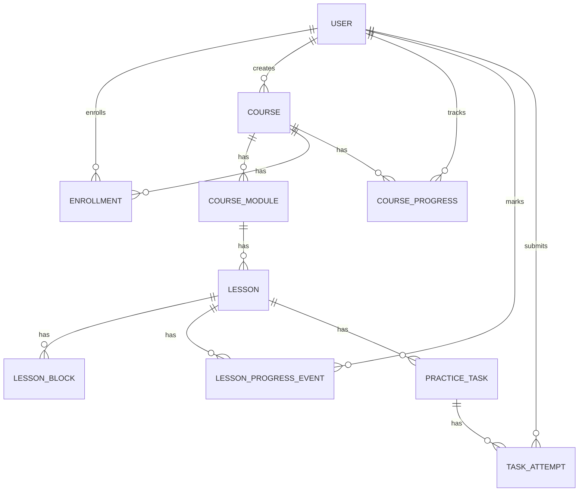
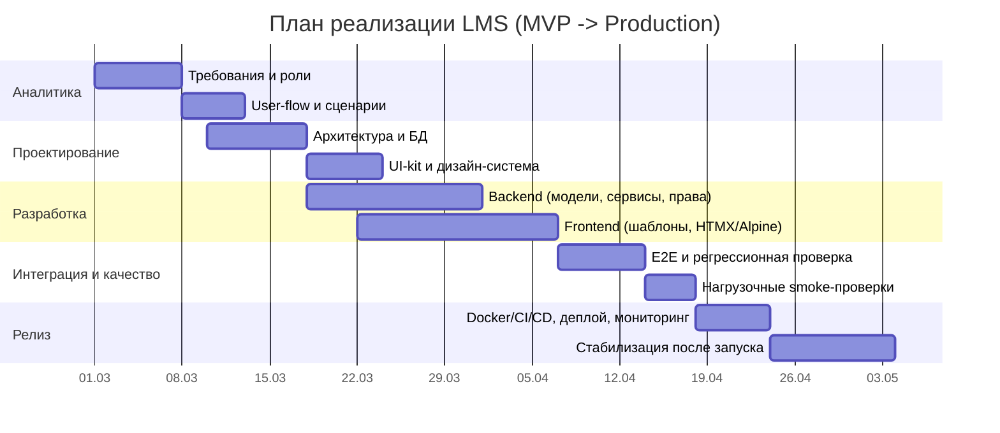
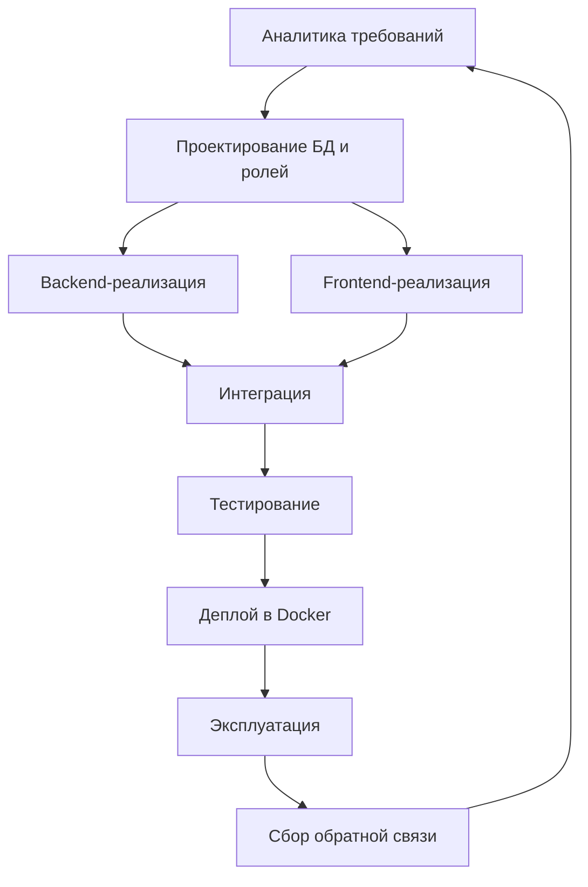
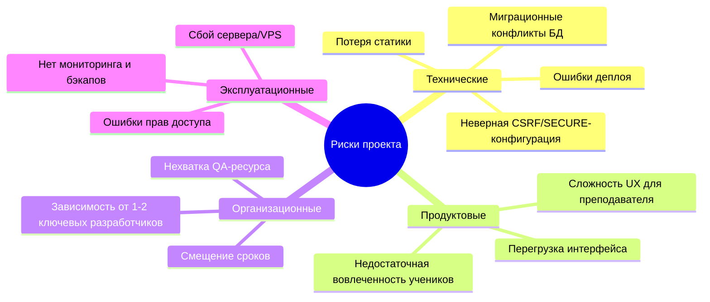

# LMS-платформа «Кванториум»: полный функционал, архитектура и проектное обоснование

## 0. Краткое описание проекта

Веб-платформа для обучения школьников и студентов с ролевой моделью, конструктором курсов, отслеживанием прогресса и административным контуром управления контентом и пользователями.

Технологический стек проекта:

- Backend: `Python 3.12`, `Django 5.2`
- DB: `PostgreSQL 15`
- Frontend: Django Templates + `HTMX` + `Alpine.js` + кастомный CSS
- Deploy: `Docker Compose`, `Nginx`, `Gunicorn`

---

## 1) Актуальность проекта, проблема, цель и задачи

## 1.1. Проблема, которую решаем

Типовые проблемы офлайн/онлайн-обучения в кружках и центрах допобразования:

- нет единого места, где хранится курс + домашка + прогресс;
- слабая персонализация по ролям (админ/преподаватель/ученик);
- ручная модерация контента и обратной связи занимает много времени;
- сложно быстро обновлять курс и отслеживать прохождение в динамике.

## 1.2. Цель проекта

Собрать единую LMS-систему с удобной контентной моделью курса, ролевым доступом и прозрачным трекингом прогресса учащихся.

## 1.3. Ключевые задачи

- реализовать ролевую модель и безопасный доступ;
- дать преподавателю конструктор курса/урока;
- дать ученику понятный сценарий: записаться -> пройти -> увидеть прогресс;
- централизовать новости, достижения, отзывы и контакты;
- обеспечить запуск и эксплуатацию в контейнерах (Docker).

---

## 2) Пользователи и их работа в системе (без роли «Родитель»)

## 2.1. Гость (неавторизованный пользователь)

Доступ:

- главная страница;
- список курсов, новости, достижения, отзывы, контакты;
- регистрация/логин.

Ограничения:

- не может записаться на курс;
- не может отмечать уроки как пройденные;
- не видит ролевые дашборды.

## 2.2. Ученик

Доступ:

- профиль с личным прогрессом;
- просмотр опубликованных курсов и уроков;
- запись/отписка от курса;
- отметка урока как пройденного;
- отправка отзыва.

Ограничения:

- нет управления курсами;
- нет доступа к админским разделам и teacher-инструментам.

## 2.3. Преподаватель

Доступ:

- отдельный teacher-дашборд;
- создание/редактирование/удаление своих курсов;
- добавление модулей, уроков и блоков урока;
- шаблоны уроков;
- дублирование блоков, drag&drop сортировка блоков;
- автосохранение черновика курса;
- предпросмотр урока как ученик;
- статистика по своим курсам.

Ограничения:

- не управляет чужими пользователями;
- не управляет системными настройками и глобальными ролями.

## 2.4. Администратор

Доступ:

- админ-дашборд с агрегированными метриками;
- управление пользователями и ролями;
- управление всеми курсами;
- управление новостями и достижениями;
- управление контактами (включая предпросмотр карты через HTMX);
- доступ к Django Admin.

---

## 3) Полный функционал системы

## 3.1. Публичный контур

- Главная страница с витриной контента.
- Каталог курсов (`/courses/`).
- Детальная страница курса (`/courses/<slug>/`).
- Детальная страница урока (`/courses/lesson/<id>/`).
- Новости (`/news/`, `/news/<slug>/`).
- Достижения (`/achievements/`).
- Отзывы (`/reviews/`, отправка формы).
- Контакты (`/contacts/`) с картой и fallback-механикой адреса.

## 3.2. Авторизация и профиль

- Логин/логаут.
- Регистрация.
- Профиль пользователя:
  - список записанных курсов,
  - процент прогресса по курсам,
  - (для преподавателя) список созданных курсов.

## 3.3. Курс и прогресс

- Запись/отписка на курс.
- Хранение прогресса в процентах.
- Отметка урока как пройденного.
- Автоматический пересчет прогресса на основе `LessonProgressEvent`.

## 3.4. Teacher-конструктор курса

- Создание курса (базовые поля + обложка + статус).
- Быстрое добавление структуры (модули/уроки строками).
- CRUD по модулям/урокам/блокам.
- Типы контент-блоков:
  - текст,
  - код,
  - изображение,
  - видео (YouTube URL -> embed),
  - файл.
- Drag&drop упорядочивание блоков.
- Дублирование блока.
- Шаблоны уроков: теория/код/задание.
- Автосохранение черновика.
- Предпросмотр урока.

## 3.5. Админский контур

- Управление пользователями и ролями.
- Управление курсами (включая назначение преподавателя).
- Модерация/ведение новостей и достижений.
- Ведение контактной информации.
- Предпросмотр карты контактов:
  - раздельный адрес (город/улица/дом),
  - валидация,
  - fallback на поиск по адресу/городу.

---

## 4) База данных

Ключевые сущности (в проекте также присутствуют стандартные таблицы Django `auth`, `sessions`, `admin`).

- `accounts_user` (кастомный пользователь с полем роли).
- `courses_course`
- `courses_coursemodule`
- `courses_lesson`
- `courses_lessonblock`
- `courses_enrollment`
- `progress_courseprogress`
- `progress_lessonprogressevent`
- `practice_practicetask`
- `practice_taskattempt`
- `news_newspost`
- `achievements_achievement`
- `reviews_review`
- `core_contactinfo`

## 4.1. ER-схема (укрупненная)



## 4.2. Логика прогресса

- `CourseProgress.percent` считается как:
  - количество уникальных уроков с событием `done`
  - деленное на количество опубликованных уроков курса
  - умноженное на 100.

---

## 5) Структура проекта (схема)

```text
kvantorium/
├─ src/
│  ├─ apps/
│  │  ├─ accounts/        # пользователи, регистрация, профиль, роли
│  │  ├─ courses/         # курсы, модули, уроки, блоки, запись
│  │  ├─ dashboard/       # role-based панели admin/teacher
│  │  ├─ progress/        # события и расчет прогресса
│  │  ├─ practice/        # задания и попытки (quiz/code/text)
│  │  ├─ news/            # новости
│  │  ├─ achievements/    # достижения
│  │  ├─ reviews/         # отзывы
│  │  ├─ core/            # главная, контакты, health, map utils
│  │  └─ audit/           # служебный модуль
│  ├─ config/
│  │  ├─ settings/
│  │  │  ├─ base.py
│  │  │  ├─ dev.py
│  │  │  └─ prod.py
│  │  └─ urls.py
│  ├─ templates/          # Django-шаблоны
│  ├─ static/             # исходные CSS/JS/img/files
│  └─ media/              # пользовательские upload-файлы
├─ deploy/nginx/          # конфиги nginx (локально)
├─ docker-compose.yml
├─ Dockerfile
└─ RUN.md
```

---

## 6) Обзор рынка аналогов и история развития

## 6.1. История развития LMS (укрупненно)

- Ранний этап: корпоративные LMS и академические платформы (упор на хранение учебных материалов).
- Этап web 2.0: интерактивные курсы, тесты, форумы, роль преподавателя/студента.
- Облачный этап: SaaS-LMS, интеграции, API, мобильные клиенты.
- Современный этап: микрообучение, аналитика прогресса, гибридные сценарии (онлайн + офлайн), AI-помощники.

## 6.2. Аналоги (класс решений)

- Универсальные LMS: Moodle, Canvas, Blackboard.
- Образовательные платформы с курсами: Stepik, Coursera, Udemy (как витрина + курс-рантайм).
- Школьный/классный контур: Google Classroom и близкие системы.

## 6.3. Отличие текущего проекта

- фокус на локальный образовательный центр (Кванториум-формат);
- простая и контролируемая ролевая модель;
- курс-конструктор под преподавателя без тяжеловесной корпоративной надстройки;
- быстрая кастомизация интерфейса и сценариев.

---

## 7) Основные этапы проектирования и реализации

## 7.1. Этапы

1. Аналитика и сбор требований.
2. Проектирование архитектуры, данных и ролей.
3. Реализация backend-моделей и бизнес-логики.
4. Реализация frontend-шаблонов и role-based UI.
5. Интеграция, тесты, отладка.
6. Контейнеризация и развертывание.
7. Эксплуатация и итерационное развитие.

## 7.2. Диаграмма сроков выполнения (план-график)



## 7.3. Диаграмма основных процессов проекта



---

## 8) Перечень используемых ресурсов и средств разработки

## 8.1. Технологические ресурсы

- Язык и фреймворк: Python + Django.
- База данных: PostgreSQL.
- Web-сервер и reverse proxy: Nginx.
- App server: Gunicorn.
- Контейнеризация: Docker + Docker Compose.
- Frontend: HTML templates, CSS, HTMX, Alpine.js.

## 8.2. Инструменты команды

- Git для контроля версий.
- IDE: VS Code / PyCharm.
- Терминальные команды Django (`manage.py migrate`, `collectstatic`, `seed_demo`).
- Браузерные devtools для UI/UX и сетевой диагностики.

---

## 9) Экономическое обоснование проекта (оценка)

Ниже модель для MVP/пилота (оценка порядка затрат, без бухгалтерской детализации).

## 9.1. Разовые затраты на запуск (пример)

- Аналитика/проектирование: 40-80 чел.-часов
- Backend-разработка: 120-220 чел.-часов
- Frontend-разработка: 100-180 чел.-часов
- QA/регресс: 40-80 чел.-часов
- Деплой и DevOps-настройка: 24-40 чел.-часов

Итого: ~324-600 чел.-часов на первую рабочую версию.

## 9.2. Ежемесячные операционные расходы (пример)

- VPS/сервер + бэкапы: 2 000-8 000 ₽/мес
- Домен/SSL/сопутствующие сервисы: 300-1 500 ₽/мес
- Поддержка и доработки: 40-100 чел.-часов/мес (в зависимости от темпа развития)

## 9.3. Эффект от внедрения

- снижение ручных операций по управлению курсами и отчетностью;
- повышение прозрачности прогресса;
- ускорение запуска новых учебных программ;
- формирование цифрового контента, который можно переиспользовать.

---

## 10) Анализ возможностей: дерево рисков



## 10.1. Базовые меры снижения рисков

- чек-листы релиза (миграции, `collectstatic`, health-check);
- staging-контур перед production;
- регулярные бэкапы БД и восстановительные тесты;
- централизованные env-настройки (`DEBUG`, cookie security, hosts);
- роль-based server-side проверки доступа на каждое критичное действие.

---

## 11) Перспективы развития проекта

1. Личный кабинет ученика с календарем и дедлайнами.
2. Система домашних заданий с проверкой и комментариями преподавателя.
3. Расширенная аналитика (когорты, retention, активность по урокам).
4. Интеграция уведомлений (email/telegram/push).
5. Экспорт/импорт курсов и шаблонов.
6. Интеграция видеохостинга и хранилищ.
7. Поддержка платных программ и подписок (при необходимости).
8. Мобильная адаптация до PWA/приложения.

---

## 12) Текущие тестовые пользователи (без родителя)

- Администратор: `admin@kvantorium.local` / `Kv@123456`
- Преподаватель: `teacher@kvantorium.local` / `Kv@123456`
- Ученик: `student@kvantorium.local` / `Kv@123456`

---

## 13) Вывод

Проект уже реализует полноценный MVP LMS с ролевой моделью, курс-конструктором, прогрессом и административным контуром. Архитектура и стек позволяют масштабировать систему в функционале и нагрузке без смены технологической базы на раннем этапе.
